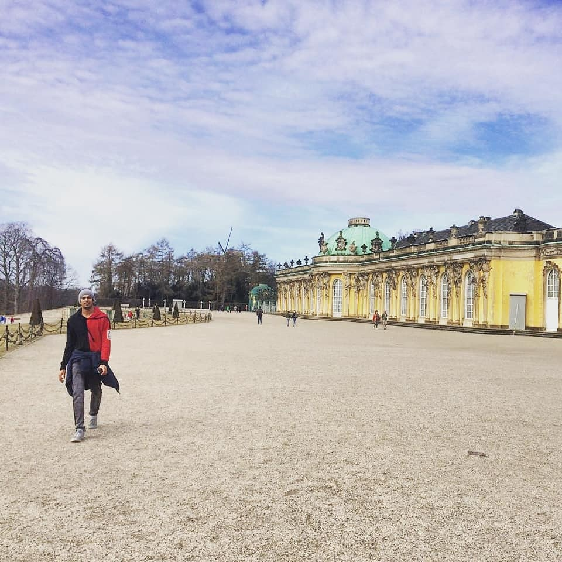

  

## Bio ##

  I'm working as a Business Development Manager in Cereals Division of Agricultural Processed Food Products Export Development Authority [APEDA](https://apeda.gov.in/apedawebsite/six_head_product/cereal.htm), Ministry of Commerce and Industry, Govt of India. 

  I received a M.Sc degree in [Agricultural Economics](https://www.uni-hohenheim.de/en/agricultural-economics-masters#:~:text=Agricultural%20research%20at%20the%20University,bio%2Dbased%20value%2Dcreation%20networks) from the [University of Hohenheim](https://www.uni-hohenheim.de/en), Stuttgart, Germany in 2019. The title of my M.Sc thesis was "Knowledge and Perception of Farmers on Solar Irrigation Pumps in Gadag District, KA, India". I am the recipient of The German Academic Exchange Service [DAAD](https://www.uni-hohenheim.de/en/agecon-scholarships) fellowship award for the year 2017. I received a B. Sc. (Agriculture Marketing and Co-operation) degree from University of Agricultural Sciences, Bengaluru, KA, India in 2013. 
   
 ** My area of work expertise include:** 
  * Handling fanancial assistance schemes of APEDA
  * Promotion of agricultural exports from the country 
  * Organizing International Buyer-Seller Meets (Physical and Virtual), Trade fares related to Cereals Division 
  * Solving technical problems related to trade issues of Cereals Division
  * Assist in signing MoU's with other organisations in order to promote Agri export from the country
  
 My research interests include  International Trade, Agricultural Export Analysis, Agricultural markets and its interlink, Sustainability, SPS measures. 

